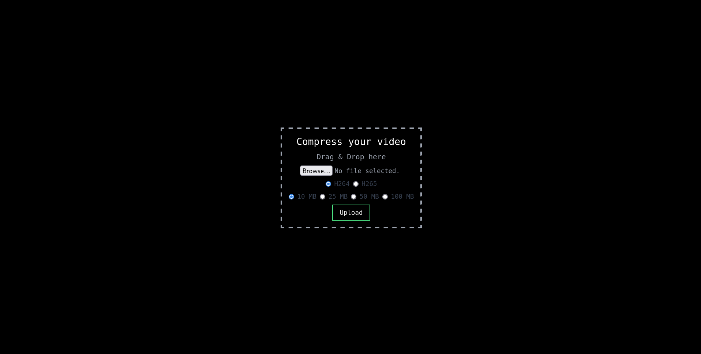

# Simple transcoding NodeJS website

To build, install Nix https://nixos.org/download\
Enter developer shell using `nix develop --command $SHELL`\
Run `tailwindcss -i ./src/input.css -o ./static/tailwind.css`\
And then run `nix-build` in the current working directory

